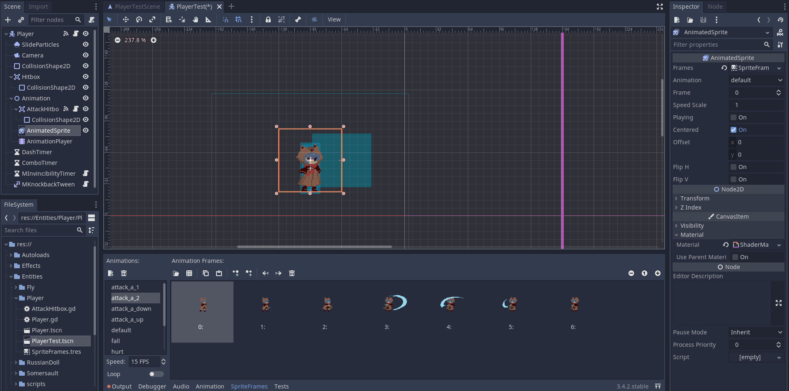
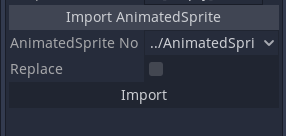

# Godot AnimatedSprite to AnimationPlayer Convertor

A Godot addon to convert animated sprite frames to animations in an animation player. Adds an extra slot in AnimationPlayers' inspector tab to import sprites from an AnimatedSprite.

## Installation

1. Clone this repository or download from the [Godot Asset Library page](https://godotengine.org/asset-library/asset/1216)
2. Copy `addons/AS2P` to your addons folder (or create a new one if you don't have one)
3. Activate the plugin in your Project Settings and you're ready to go!

## Usage

1. Select the `AnimationPlayer` node to import the sprites to.
2. In the drop-down, select the path to the AnimatedSprite to import the sprites from.
3. Click "Import" to convert.

For existing animations, the plugin will automatically update only the necessary tracks
